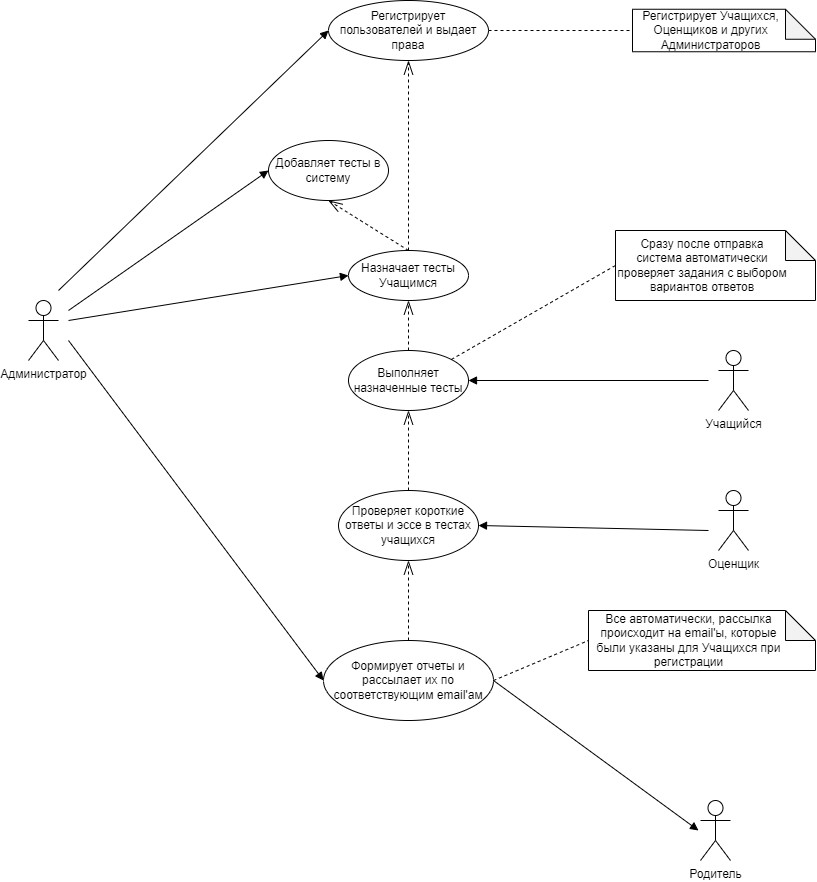

# Лабораторная работа 1

## Постановка

Тема: Формулирование требований к программной системе
Цель работы: Научиться анализировать поставленную задачу, формулировать функциональные и нефункциональные требования к проектируемой системе.
Ожидаемые результаты:
Перечень заинтересованных лиц (стейкхолдеров) с краткими описаниями (2 балла)
Перечень функциональных требований (2 балла)
Диаграмма вариантов использования для функциональных требований (2 балла)
Перечень сделанных предположений (всё, что не оговорено в постановке явно можно “додумать” самостоятельно) (2 балла)

Повышенная сложность:
Перечень нефункциональных требований (2 балла)

Дополнительные материалы:
Литература по анализу нефункциональных требований (архитектурных свойств): главы 4 и 5 в книге “Фундаментальный подход к программной архитектуре” М.Ричардса и Нила Форда

## Перечень стейкхолдеров

1. **Администрация округа.** Заинтересована в общем функционировании системы и удовлетворении требований всех остальных стейкхолдеров

2. **Учащиеся.** Хотят удобный интерфейс для выполнения тестов
3. **Оценщики.** Нужна возможность оценивать короткие ответы и эссе всех учеников
4. **Администраторы.** Должны иметь возможность добавлять в систему учеников, родителей, учителей и оценщиков, а также раздавать им всем корректные права
5. **Государство.** Три различных государственных органа (определенные, но неназванные) должны убедиться в безопасности системы и утвердить изменения в процесс тестирования
6. **Родители** Заинтересованы в получении результатов их ученика

## Функциональные требования

- Администраторы создают учетные записи для пользователей системы и выдают им соответствующие права/роли
- Администраторы добавляют тесты в систему
- Администраторы назначают тесты учащимся
- Программа отображает учащимся все тесты, которые им доступны для прохождения в данный момент
- Учащиеся выполняют тесты
- Программа проверяет задания с выбором варианта ответа (вариантов ответов), сверяя их с загруженными ранее Администратором правильными ответами
- Оценщик проверяет короткие ответы и эссе каждого ученика и выставляет корректные баллы за них
- Система хранит результаты каждого учащегося по каждому тесту, который он сделал
- Программа формирует отчеты о результатах тестов

## Нефункциональные требования

- Система соответствует критериям безопасности всех трех государственных органов, упомянутых в постановке
- Программа должна иметь резервную копию оценок учащихся
- Проект не должен быть слишком убыточным (никаких затрат сверх необходимого, весь бюджет проекта каждый год согласуется)

## Предположения

- Поскольку родители должны иметь возможность просматривать результаты своего ребенка, а устанавливать для этого целое приложение нерационально, необходимо веб-приложение
- В вебе может быть вся система или только часть, отвечающая за предоставление отчета родителям
- Оценщик не должен знать, чью работу он проверяет (если только не подразумевается, что Учащихся оценивают их же учителя)
- Родители должны каким-то образом получать информацию о том, сколько баллов получил их ребенок за каждый тест (у ученика при регистрации указывается электронная почта родителей (одного или обоих), на эту почту приходят результаты тестов учащегося)
- Поскольку Учащихся и Оценщиков очень много (40000 и 2000 соответственно), массовую регистрацию можно автоматизировать: загружать в систему excel-файл с полями: Роль, СНИЛС (уникальный идентификатор), Фамилия, Имя, Отчество, Дата рождения, e-mail. Далее поля только для Учащегося: СНИЛС учителя (классного руководителя), e-mail родителей 1, e-mail родителей 2 (необязательно). После импорта пользователей в систему, им на почту придут логин и пароль

## Диаграмма вариантов использования для функциональных требований

