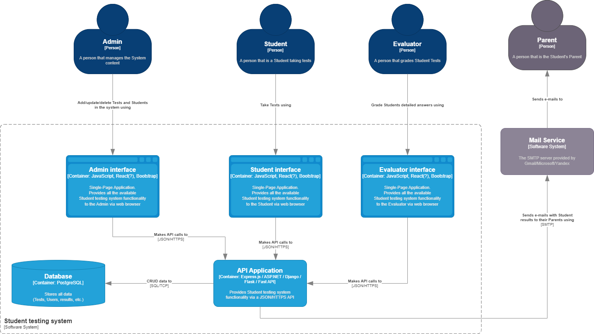
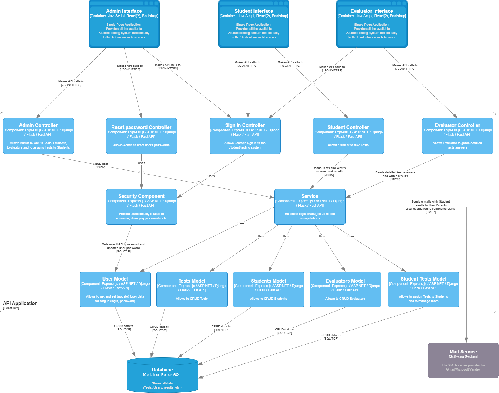

# Лабораторная работа 2

## Постановка

Тема: Использование нотации C4 model для проектирования архитектуры программной системы

Цель работы: Получить опыт использования графической нотации для фиксации архитектурных решений

Ожидаемые результаты:

1. Диаграмма системного контекста (3 балла)
2. Диаграмма контейнеров с пояснениями по выбору базового архитектурного стиля / архитектуры уровня приложений (при этом выбрать топологию, подразумевающую несколько модулей развертывания и наличие сетевого взаимодействия) (5 баллов)

Повышенная сложность: 
1. Диаграмма компонентов (2 балла)

Дополнительные материалы:

Пример:
- https://github.com/team7katas/sysopsquad#system-context
- https://github.com/team7katas/sysopsquad#containers

Литература по архитектурным стилям: 
- главы 9-18 в книге “Фундаментальный подход к программной архитектуре” М.Ричардса и Нила Форда

Дополнительные материалы по C4 model:
- https://c4model.com/
- https://www.youtube.com/watch?v=uHBmx7HcmJQ

## System context diagram

## Container diagram

В качестве базовой использовалась стандартная клиент-серверная архитектура. Клиентом в данном случае выступает Браузер (Single-Page Application с собственными интерфейсами для 3-х групп пользователей). 

## Component diagram

Сервер состоит из контроллеров, бизнес-логики и уровня доступа к данным.

