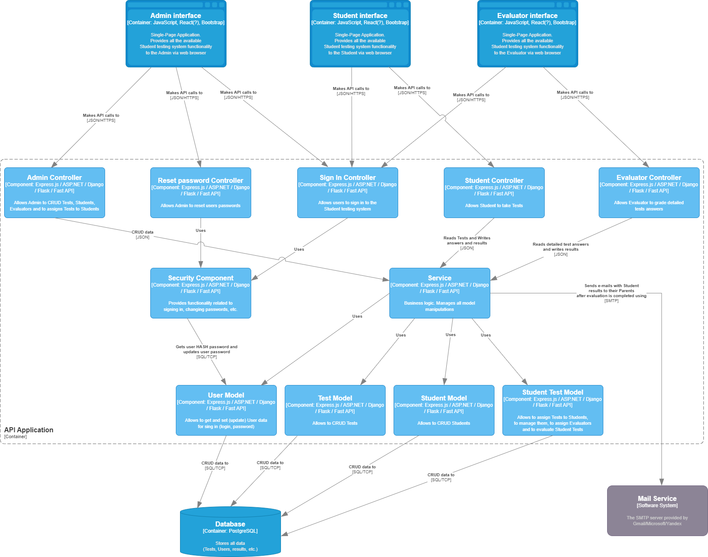
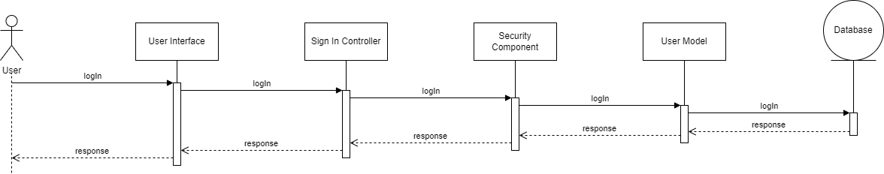
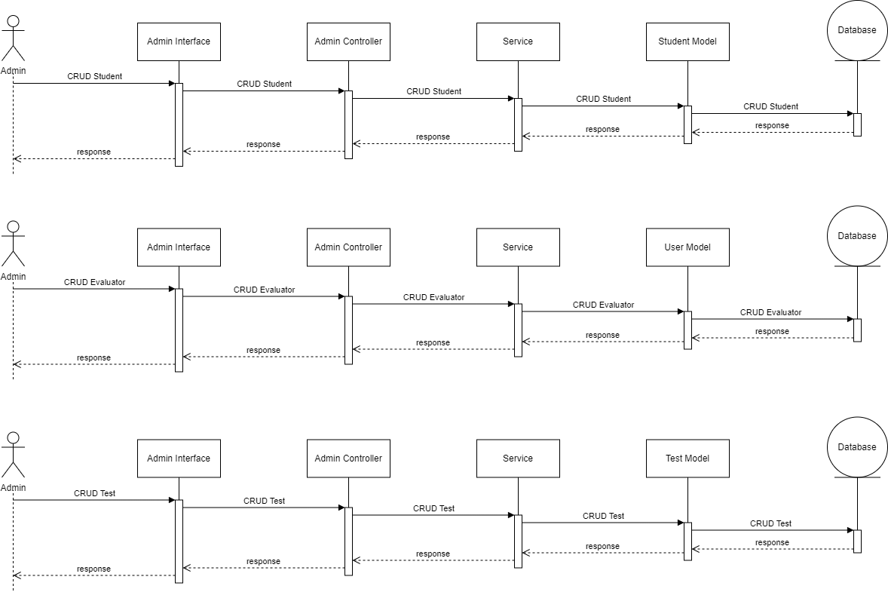
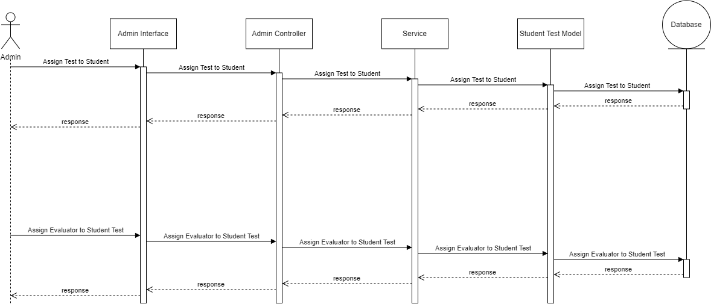
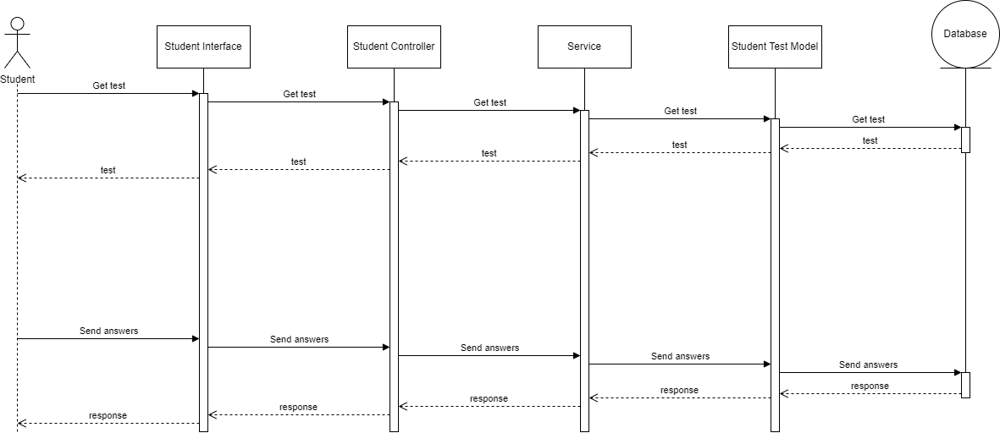
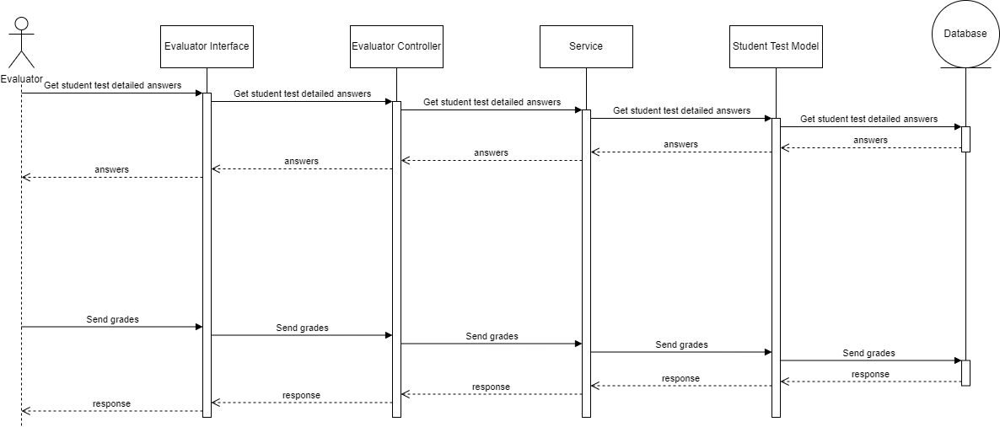
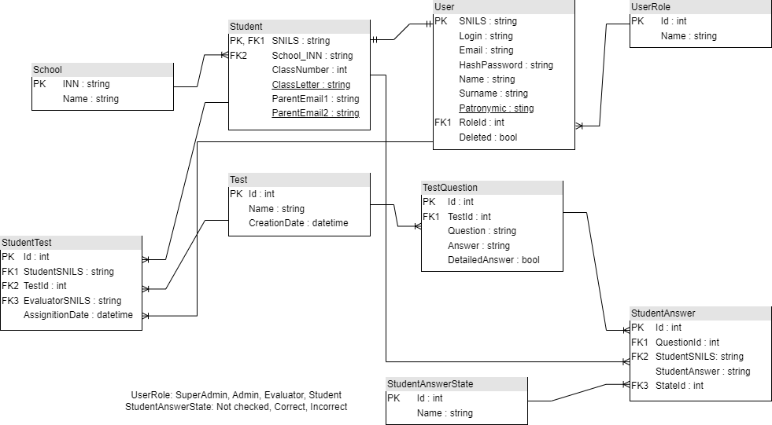

# Лабораторная работа 3

## Диаграмма компонентов

Изменил диаграмму компонентов: незначительно поменял названия нескольких компонентов и удалил один модуль, поскольку оказалось, что он не нужен.

## Диаграммы последовательностей

Разделил на несколько диаграмм, так как в одну все поместить сложно и нецелесообразно.

### Вход в систему

Универсальный процесс для пользователя с любой ролью.

### CRUD функции администратора

Показывает, что администратор может манипулировать различными объектами в системе.

### Назначение теста

Процесс назначения теста учащемуся. Данный процесс также включает в себя назначение проверяющего для данных теста и учащегося.

### Прохождение теста

Процесс прохождения теста учащимся. Состоит из получения теста и отправки ответов на него.

### Проверка развернутых ответов

Оцениваание развернутых ответов учащегося на тест также включает в себя получение информации о вопросах, ответах учащегося и правильных ответах и отправку оценок за ответы.

## Модель БД

<b>UserRole и StudentAnswerState</b> - это справочники, на диаграмме указаны все значения, которые должны содержаться в них.

<b>School</b> - таблица, содержащая школы. Хоть это и сущность, она изменяется нечасто, поэтому интерфейс для добавления/изменения/удаления не является приоритетом.

<b>User</b> - пользователь системы, у него есть поле, отображающее его роль. SuperAdmin, Admin и Evaluator имеют идентичный набор полей, поэтому для них отдельных таблиц нет.

<b>SuperAdmin</b> - пользователь, который может добавлять администраторов (Admin) и имеет неограниченные полномочия в системе.

<b>Student</b> - учащийся. Является пользователем с дополнительными полями: номером и буквой класса, школой и e-mail'ами родителей.

<b>Test</b> - тест; состоит из вопросов.

<b>TestQuestion</b> - вопрос теста. Один вопрос может принадлежать только одному тесту, но один тест может иметь неограниченное число вопросов.

<b>StudentTest</b> - связь между учащимся и тестом, которая позволяет назначить тест учащемуся. Также в этой таблице паре учащийся-тест назначается проверяющий.

<b>StudentAnswer</b> - связь между студентом и вопросом. Позволяет хранить информацию об ответе учащегося на конкретный вопрос, а также о правильности этого ответа.

## Применение основных принципов разработки

Не успел, возможно позже сделаю

## Дополнительные принципы разработки

### BDUF. Big design up front

В основе данного принципа лежит идея "сначала проектирование, затем разработка". 
Данного принципа по возможности лучше придерживаться в любом проекте, в том числе и в данном. На самом деле первые 3 лабораторные работы уже реализуют данный принцип, ведь в них и осуществляется анализ и проектирование системы. Благодаря этому в системе будет значительно меньше критических ошибок и несостыковок, не будет необходимости переписывать большие части кода.

Бесполезен данный принцип только в случае, если система маленькая и простая и если есть уверенность, что она не будет масштабироваться или значительно усложняться / модифицироваться.

### SoC. Separation of concerns

Принцип разделения ответветственности предполагает разделение системы на функциональные блоки, изоляция разных функций друг от друга.

Данный принцип в той или иной степени встречается в коде повсюду: взаимодействие двух больших модулей (например, API и отправка e-mail'ов в данном проекте) и взаимодействие двух методов (пример - один метод производит вычисление, второй - их отображает).

Полный отказ от данного принципа неосуществим, но если говорить именно о разделении логики на большие функциональные блоки, то в данном проекте есть следующие примеры:

- разные контроллеры для разных групп пользователей,
- отдельный компонент, отвечающий за вход в систему,
- логика отправки почты, вынесенная за рамки API.

### MVP. Minimum viable product

Данная концепция подразумевает создание сначала основного функционала, без которого система не имеет смысла, а потом опционального (требуемых, но менее обязательных функций).

Отказаться от применения данного принципа можно, если разработка производится по принципу "водопада": сроки, требования и ресурсы известны, поэтому можно реализовывать весь функционал постепенно.

В данном проекте я планирую придерживаться данного принципа, потому что он позволяет сосредоточится сначала на главном, отбросив все второстепенного. Однако можно обойтись и без него, это лишь вопрос предпочтений.

Пример MVP в этом проекте: CRUD операции администратора, а также  прохождение и автоматическая оценка тестов (развернутые ответы проверяются полным сравнением с правильным, так же как и короткие).

### PoC. Proof of concept

Иедя заключается в создании прототипа, на котором можно проверить и продемонстрировать осуществимость определенного метода / решения / идеи.

В данном проекте принцип я применять не планирую, поскольку здесь нет логики

Этот принцип в данном проекте я планирую применить единожды: при настройке отправки e-mail сообщений. Сначала я буду отправлять письмо с простейшим содержимым, чтобы настроить именно процесс отправки. Письма будут отправляться в отдельной программе, никак не связанной с данным проектом, при запуске из метода Main.