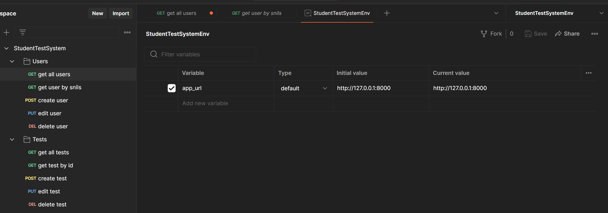
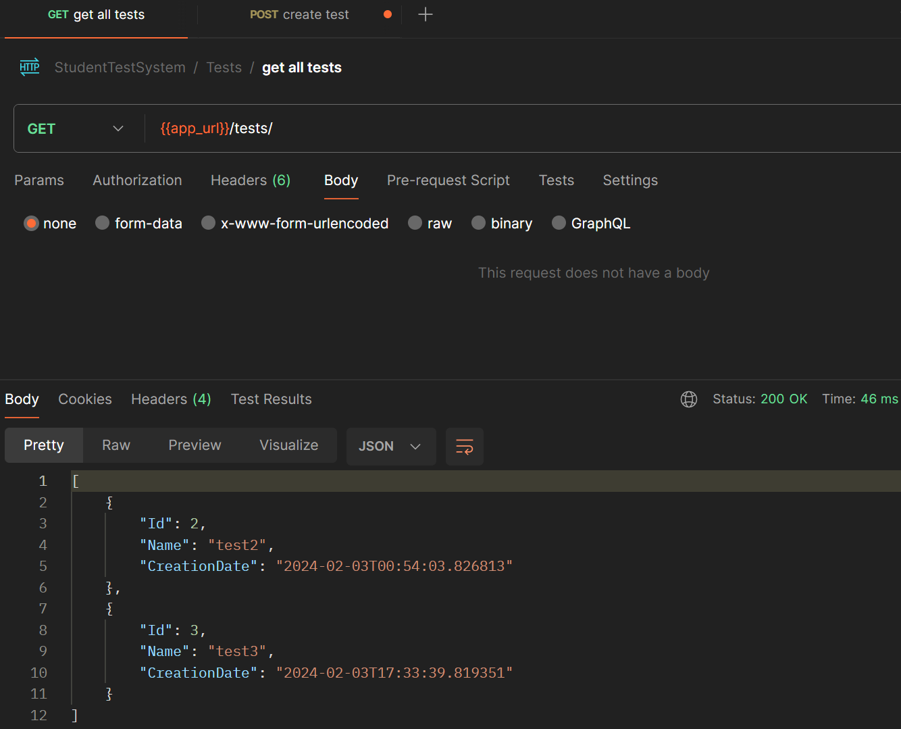

# Лабораторная работа 4

## API

<b>Ошибки 401 и 403 не используются, так как для них требуется аутентификация и авторизация, реализация которых на данном этапе не предполагается.</b>

### Postman: Enviroment Variables and Structure



### Users

<details>
<summary>
    <code>GET</code> <b><code>/users</code></b> Возвращает информацию обо всех пользователях в системе
</summary>

#### Parameters
> None

#### Responses
> | http code     | content-type                      | response                                                            |
> |---------------|-----------------------------------|---------------------------------------------------------------------|
> | `200`         | `text/plain;charset=UTF-8`        | JSON-objects                                                        |
> | `401`         | `text/plain;charset=UTF-8`        | `You are not authorized`                                            |
> | `403`         | `text/plain;charset=UTF-8`        | `You don't have access rights to this content`                      |

##### Response Format (200)
```json
[
    {
        "SNILS": "string",
        "Login": "string",
        "Email": "string",
        "HashPassword": "string",
        "Name": "string",
        "Surname": "string",
        "Patronymic": "string",
        "RoleId": 0
    }
]
```

##### Example Query
http://127.0.0.1:8000/users/

##### Example Response

</details>


<details>
<summary>
    <code>GET</code> <b><code>/users/{snils}</code></b> Возвращает информацию о пользователе по СНИЛСу
</summary>

#### Parameters
> | name              |  type     | data type      | description                         |
> |-------------------|-----------|----------------|-------------------------------------|
> | `snils`           |  required | string         | `SNILS`                             |

#### Responses
> | http code     | content-type                      | response                                                            |
> |---------------|-----------------------------------|---------------------------------------------------------------------|
> | `200`         | `text/plain;charset=UTF-8`        | JSON-object                                                         |
> | `400`         | `text/plain;charset=UTF-8`        | `Invalid SNILS value`                                               |
> | `401`         | `text/plain;charset=UTF-8`        | `You are not authorized`                                            |
> | `403`         | `text/plain;charset=UTF-8`        | `You don't have access rights to this content`                      |
> | `404`         | `text/plain;charset=UTF-8`        | `User with such SNILS not found`                                    |

##### Response Format (200)
```json
{
    "SNILS": "string",
    "Login": "string",
    "Email": "string",
    "HashPassword": "string",
    "Name": "string",
    "Surname": "string",
    "Patronymic": "string",
    "RoleId": 0
}
```

##### Example Query
http://127.0.0.1:8000/users/00000000003

##### Example Response

</details>


<details>
<summary>
    <code>POST</code> <b><code>/users</code></b> Создает нового пользователя
</summary>

#### Parameters
> None

#### Body
```json
{
    "SNILS": "string",
    "Login": "string",
    "Email": "string",
    "HashPassword": "string",
    "Name": "string",
    "Surname": "string",
    "Patronymic": "string",
    "RoleId": 0
}
```

#### Responses
> | http code     | content-type                      | response                                                            |
> |---------------|-----------------------------------|---------------------------------------------------------------------|
> | `201`         | `text/plain;charset=UTF-8`        | `User created successfully`                                         |
> | `400`         | `text/plain;charset=UTF-8`        | `Invalid user info`                                                 |
> | `401`         | `text/plain;charset=UTF-8`        | `You are not authorized`                                            |
> | `403`         | `text/plain;charset=UTF-8`        | `You don't have access rights to this action`                       |
> | `409`         | `text/plain;charset=UTF-8`        | `User with such SNILS already exists`                               |

##### Example Query and Response
http://127.0.0.1:8000/users/


</details>


<details>
<summary>
    <code>PUT</code> <b><code>/users/{snils}</code></b> Обновляет информацию о пользователе по СНИЛСу
</summary>

#### Parameters
> | name              |  type     | data type      | description                         |
> |-------------------|-----------|----------------|-------------------------------------|
> | `snils`           |  required | string         | `SNILS`                             |

#### Body
```json
{
    "Login": "string",
    "Email": "string",
    "HashPassword": "string",
    "Name": "string",
    "Surname": "string",
    "Patronymic": "string",
    "RoleId": 0
}
```

#### Responses
> | http code     | content-type                      | response                                                            |
> |---------------|-----------------------------------|---------------------------------------------------------------------|
> | `200`         | `text/plain;charset=UTF-8`        | `User updated successfully`                                         |
> | `400`         | `text/plain;charset=UTF-8`        | `Invalid user info`                                                 |
> | `401`         | `text/plain;charset=UTF-8`        | `You are not authorized`                                            |
> | `403`         | `text/plain;charset=UTF-8`        | `You don't have access rights to this action`                       |
> | `404`         | `text/plain;charset=UTF-8`        | `User with such SNILS not found`                                    |

##### Example Query and Response
http://127.0.0.1:8000/users/00000000004


</details>


<details>
<summary>
    <code>DELETE</code> <b><code>/users/{snils}</code></b> Удаляет пользователя по СНИЛСу
</summary>

#### Parameters
> | name              |  type     | data type      | description                         |
> |-------------------|-----------|----------------|-------------------------------------|
> | `snils`           |  required | string         | `SNILS`                             |

#### Responses
> | http code     | content-type                      | response                                                            |
> |---------------|-----------------------------------|---------------------------------------------------------------------|
> | `204`         | `text/plain;charset=UTF-8`        | `User deleted successfully`                                         |
> | `400`         | `text/plain;charset=UTF-8`        | `Invalid SNILS value`                                               |
> | `401`         | `text/plain;charset=UTF-8`        | `You are not authorized`                                            |
> | `403`         | `text/plain;charset=UTF-8`        | `You don't have access rights to this action`                       |
> | `404`         | `text/plain;charset=UTF-8`        | `User with such SNILS not found`                                    |

##### Example Query and Response
http://127.0.0.1:8000/users/00000000004


</details>


### Tests

<details>
<summary>
    <code>GET</code> <b><code>/tests</code></b> Возвращает всю информацию обо всех тестах в системе
</summary>

#### Parameters
> None

#### Responses
> | http code     | content-type                      | response                                                            |
> |---------------|-----------------------------------|---------------------------------------------------------------------|
> | `200`         | `text/plain;charset=UTF-8`        | JSON-objects                                                        |
> | `401`         | `text/plain;charset=UTF-8`        | `You are not authorized`                                            |
> | `403`         | `text/plain;charset=UTF-8`        | `You don't have access rights to this content`                      |

##### Response Format (200)
```json
[
    {
        "Id": 0,
        "Name": "string",
        "CreationDate": 01/01/2000 00:00:00
    }
]
```

##### Example Query
http://127.0.0.1:8000/tests/

##### Example Response

</details>


<details>
<summary>
    <code>GET</code> <b><code>/tests/{id}</code></b> Возвращает всю информацию о тесте по его идентификатору
</summary>

#### Parameters
> | name              |  type     | data type      | description                         |
> |-------------------|-----------|----------------|-------------------------------------|
> | `id`              |  required | int            | `Unique test id`                    |

#### Responses
> | http code     | content-type                      | response                                                            |
> |---------------|-----------------------------------|---------------------------------------------------------------------|
> | `200`         | `text/plain;charset=UTF-8`        | JSON-object                                                         |
> | `400`         | `text/plain;charset=UTF-8`        | `Invalid id`                                                        |
> | `401`         | `text/plain;charset=UTF-8`        | `You are not authorized`                                            |
> | `403`         | `text/plain;charset=UTF-8`        | `You don't have access rights to this content`                      |
> | `404`         | `text/plain;charset=UTF-8`        | `Test with such id not found`                                       |

##### Response Format (200)
```json
{
    "Id": 0,
    "Name": "string",
    "CreationDate": 01/01/2000 00:00:00
}
```

##### Example Query
http://127.0.0.1:8000/tests/2

##### Example Response

</details>


<details>
<summary>
    <code>POST</code> <b><code>/tests</code></b> Создает новый тест
</summary>

#### Parameters
> None

#### Body
```json
{
    "Name": "string",
    "CreationDate": 01/01/2000 00:00:00
}
```

#### Responses
> | http code     | content-type                      | response                                                            |
> |---------------|-----------------------------------|---------------------------------------------------------------------|
> | `201`         | `text/plain;charset=UTF-8`        | Id of the created test                                              |
> | `400`         | `text/plain;charset=UTF-8`        | `Invalid test info`                                                 |
> | `401`         | `text/plain;charset=UTF-8`        | `You are not authorized`                                            |
> | `403`         | `text/plain;charset=UTF-8`        | `You don't have access rights to this action`                       |

##### Example Query and Response
http://127.0.0.1:8000/tests/


</details>


<details>
<summary>
    <code>PUT</code> <b><code>/tests/{id}</code></b> Обновляет информацию о тесте по его идентификатору
</summary>

#### Parameters
> | name              |  type     | data type      | description                         |
> |-------------------|-----------|----------------|-------------------------------------|
> | `id`              |  required | int            | `Unique test id`                    |

#### Body
```json
{
    "Name": "string",
    "CreationDate": 01/01/2000 00:00:00
}
```

#### Responses
> | http code     | content-type                      | response                                                            |
> |---------------|-----------------------------------|---------------------------------------------------------------------|
> | `200`         | `text/plain;charset=UTF-8`        | `Test updated successfully`                                         |
> | `400`         | `text/plain;charset=UTF-8`        | `Invalid test info`                                                 |
> | `401`         | `text/plain;charset=UTF-8`        | `You are not authorized`                                            |
> | `403`         | `text/plain;charset=UTF-8`        | `You don't have access rights to this action`                       |
> | `404`         | `text/plain;charset=UTF-8`        | `Test with such id not found`                                       |

##### Example Query and Response
http://127.0.0.1:8000/tests/2


</details>


<details>
<summary>
    <code>DELETE</code> <b><code>/tests/{id}</code></b> Удаляет тест по его идентификатору
</summary>

#### Parameters
> | name              |  type     | data type      | description                         |
> |-------------------|-----------|----------------|-------------------------------------|
> | `id`              |  required | int            | `Unique test id`                    |

#### Responses
> | http code     | content-type                      | response                                                            |
> |---------------|-----------------------------------|---------------------------------------------------------------------|
> | `204`         | `text/plain;charset=UTF-8`        | `Test deleted successfully`                                         |
> | `401`         | `text/plain;charset=UTF-8`        | `You are not authorized`                                            |
> | `403`         | `text/plain;charset=UTF-8`        | `You don't have access rights to this action`                       |
> | `404`         | `text/plain;charset=UTF-8`        | `Test with such id not found`                                       |

##### Example Query and Response
http://127.0.0.1:8000/tests/2


</details>


### Test questions

<details>
<summary>
    <code>GET</code> <b><code>/testQuestions/{testId}</code></b> Возвращает информацию обо всех вопросах заданного теста. Тест задается по идентификатору
</summary>

#### Parameters
> | name              |  type     | data type      | description                         |
> |-------------------|-----------|----------------|-------------------------------------|
> | `testId`          |  required | int            | `Unique test id`                    |

#### Responses
> | http code     | content-type                      | response                                                            |
> |---------------|-----------------------------------|---------------------------------------------------------------------|
> | `200`         | `text/plain;charset=UTF-8`        | JSON-objects                                                        |
> | `401`         | `text/plain;charset=UTF-8`        | `You are not authorized`                                            |
> | `403`         | `text/plain;charset=UTF-8`        | `You don't have access rights to this content`                      |
> | `404`         | `text/plain;charset=UTF-8`        | `Test with such id not found`                                       |

##### Example Value
```json
[
    {
        "Id": 0,
        "TestId": 0,
        "Question": "string",
        "Answer": "string",
        "DetailedAnswer": false
    }
]
```
</details>


<details>
<summary>
    <code>GET</code> <b><code>/questions/{id}</code></b> Возвращает всю информацию о вопросе по идентификатору
</summary>

#### Parameters
> | name              |  type     | data type      | description                         |
> |-------------------|-----------|----------------|-------------------------------------|
> | `id`              |  required | int            | `Unique question id`                |

#### Responses
> | http code     | content-type                      | response                                                            |
> |---------------|-----------------------------------|---------------------------------------------------------------------|
> | `200`         | `text/plain;charset=UTF-8`        | JSON-object                                                         |
> | `400`         | `text/plain;charset=UTF-8`        | `Invalid id`                                                        |
> | `401`         | `text/plain;charset=UTF-8`        | `You are not authorized`                                            |
> | `403`         | `text/plain;charset=UTF-8`        | `You don't have access rights to this content`                      |
> | `404`         | `text/plain;charset=UTF-8`        | `Question with such id not found`                                   |

##### Example Value
```json
{
    "Id": 0,
    "TestId": 0,
    "Question": "string",
    "Answer": "string",
    "DetailedAnswer": false
}
```
</details>


<details>
<summary>
    <code>POST</code> <b><code>/testQuestions/{testId}</code></b> Создает вопрос для теста с заданным идентификатором
</summary>

#### Parameters
> | name              |  type     | data type      | description                         |
> |-------------------|-----------|----------------|-------------------------------------|
> | `testId`          |  required | int            | `Unique test id`                    |

#### Body
```json
{
    "Question": "string",
    "Answer": "string",
    "DetailedAnswer": false
}
```

#### Responses
> | http code     | content-type                      | response                                                            |
> |---------------|-----------------------------------|---------------------------------------------------------------------|
> | `201`         | `text/plain;charset=UTF-8`        | Id of the created question                                          |
> | `400`         | `text/plain;charset=UTF-8`        | `Invalid test info`                                                 |
> | `401`         | `text/plain;charset=UTF-8`        | `You are not authorized`                                            |
> | `403`         | `text/plain;charset=UTF-8`        | `You don't have access rights to this action`                       |
</details>


<details>
<summary>
    <code>PUT</code> <b><code>/questions/{id}</code></b> Обновляет информацию о вопросе по его идентификатору
</summary>

#### Parameters
> | name              |  type     | data type      | description                         |
> |-------------------|-----------|----------------|-------------------------------------|
> | `id`              |  required | int            | `Unique question id`                |

#### Body
```json
{
    "TestId": 0,
    "Question": "string",
    "Answer": "string",
    "DetailedAnswer": false
}
```

#### Responses
> | http code     | content-type                      | response                                                            |
> |---------------|-----------------------------------|---------------------------------------------------------------------|
> | `200`         | `text/plain;charset=UTF-8`        | `Question updated successfully`                                     |
> | `400`         | `text/plain;charset=UTF-8`        | `Invalid question info`                                             |
> | `401`         | `text/plain;charset=UTF-8`        | `You are not authorized`                                            |
> | `403`         | `text/plain;charset=UTF-8`        | `You don't have access rights to this action`                       |
> | `404`         | `text/plain;charset=UTF-8`        | `Question with such id not found`                                   |
</details>


<details>
<summary>
    <code>DELETE</code> <b><code>/questions/{id}</code></b> Удаляет вопрос по его идентификтаору
</summary>

#### Parameters
> | name              |  type     | data type      | description                         |
> |-------------------|-----------|----------------|-------------------------------------|
> | `id`              |  required | int            | `Unique question id`                |

#### Responses
> | http code     | content-type                      | response                                                            |
> |---------------|-----------------------------------|---------------------------------------------------------------------|
> | `204`         | `text/plain;charset=UTF-8`        | `Question deleted successfully`                                     |
> | `401`         | `text/plain;charset=UTF-8`        | `You are not authorized`                                            |
> | `403`         | `text/plain;charset=UTF-8`        | `You don't have access rights to this action`                       |
> | `404`         | `text/plain;charset=UTF-8`        | `Question with such id not found`                                   |
</details>
